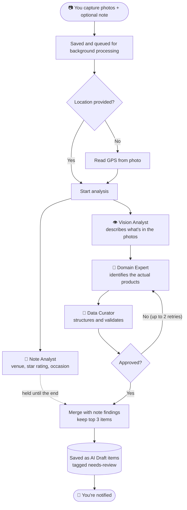
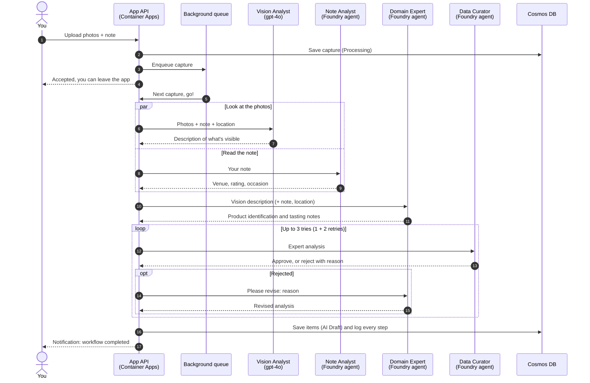
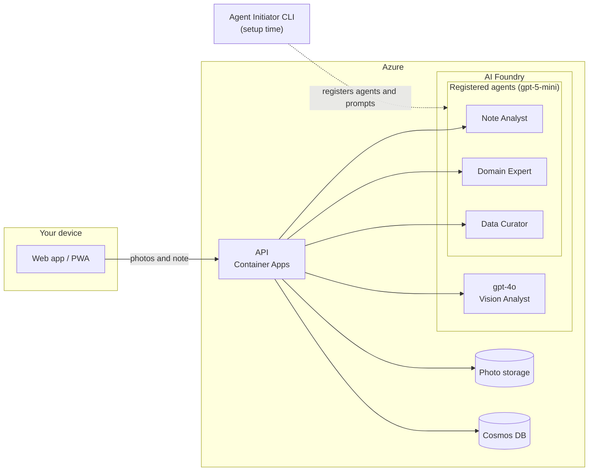
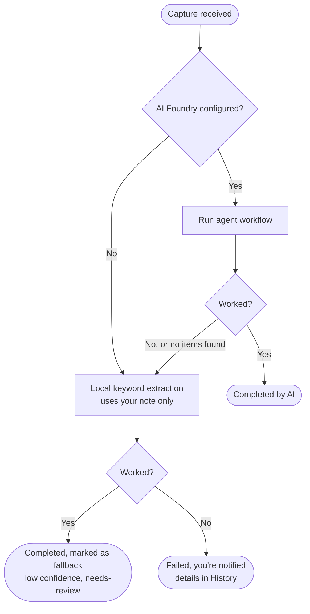
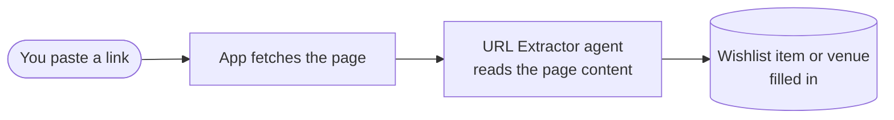

# How Our AI Agents Read Your Photos

You snap a photo of a bottle, a glass, or a cigar band, maybe type a quick note, and a few minutes later a
fully filled-in entry shows up in your collection. This page explains what happens in between.

Think of it as a small **tasting panel**: one person looks at the photo, one reads your note, one is the
resident expert who knows the products, and one is the editor who checks the paperwork before it's filed.

## The Cast

| Agent | Think of it as... | What it does | Model |
|-------|-------------------|--------------|-------|
| **Vision Analyst** | The person with the sharp eyes | Looks at your photos and describes what's in front of you: labels, bottle shapes, liquid color, cigar bands, plating. It only reports what it *sees*. It doesn't guess the product. | `gpt-4o` |
| **Note Analyst** | The person who reads your scribbles | Reads your quick note and pulls out *where* you were, *how you felt* (turned into a 1-5 star suggestion), and the *occasion* (date night, celebration...). | `gpt-5-mini` |
| **Domain Expert** | The sommelier / master blender / tobacconist | Takes the Vision Analyst's description and names the actual product: distillery, age, region, vintage, cigar vitola. Adds tasting notes, price range, pairings, and a confidence score. | `gpt-5-mini` |
| **Data Curator** | The editor | Turns the expert's write-up into a tidy, validated record and checks it's complete and sensible. If something is off, it sends it back with feedback. | `gpt-5-mini` |

A few ground rules baked into the agents:

- **Foreground only.** They focus on the 1-3 things *you* are drinking or smoking. Bottles on the back
  shelf and other tables are ignored.
- **A bottle and the glass poured from it count as one item**, not two.
- **Maximum of 3 items per capture**, keeping the highest-confidence ones.
- **Your note is treated as information, not orders.** Text in a note can't tell an agent to behave differently.

## Where Everything Runs

| Piece | Where it lives |
|-------|----------------|
| **The app's API** (the "conductor" that runs the workflow) | Azure Container Apps (or Docker Compose when self-hosted) |
| **The agents and AI models** | Microsoft Azure AI Foundry (Foundry Agent Service) |
| **Your photos** | Blob storage (local disk when self-hosted) |
| **Your items, captures and the step-by-step log** | Azure Cosmos DB |
| **Agent instructions (prompts)** | Markdown files in `src/AgentInitiator/Prompts/`, loaded into Foundry by the **Agent Initiator** tool |

The **Agent Initiator** is a small command-line tool run at setup time (`task local:agents`). It registers
the agents in Foundry and gives each its instructions. To change how an agent behaves, edit its prompt file
and re-run that tool. Sign-in between the app and Foundry uses Azure identity, so there are no passwords
or keys stored in the app.

## The Workflow, Step by Step

1. **You capture.** The photos and your note are saved and the capture is placed in a queue. You're free to
   leave the app; processing happens in the background.
2. **Location check.** If you didn't share your location, the app tries to read GPS data hidden in the photo.
3. **Vision Analyst and Note Analyst run at the same time.** Neither needs the other's help, so
   they work in parallel. (The Note Analyst only runs if you wrote a note.)
4. **Domain Expert** gets the photo description, your note, and location, and identifies the products.
5. **Data Curator** structures the result and reviews it.
   - **Approved:** on to the next step.
   - **Rejected:** the curator explains why, and the Domain Expert tries again with that feedback.
     This can happen **up to 2 times**; after that the best attempt is accepted so you're never stuck.
6. **Item creation.** Results are combined with the Note Analyst's findings (venue, star suggestion,
   occasion tag) and saved as **AI Draft** items tagged `needs-review`, so you can confirm or fix them.
7. **You get a notification** that your capture is done. Every step is recorded and visible in History.

### Workflow diagram

### Who talks to whom (sequence)

### Where things run (architecture)

## What if Something Goes Wrong?

The app is built to always give you *something* rather than a blank screen.

- **Note Analyst fails?** The workflow carries on without it. You just lose the venue/star suggestions.
- **An agent takes longer than 3 minutes?** It's cut off and the fallback kicks in.
- **Fallback items** are guessed from your note's keywords, get a low confidence score, and are tagged
  `needs-review` so you know to double-check them.

## Other Agents: Wishlist and Venue Links

The same Foundry setup powers two "paste a link" features. Each works in the background too:

| Agent | Trigger | What it does |
|-------|---------|--------------|
| **Wishlist URL Extractor** | You paste a product page into your wishlist | The app fetches the page, and the agent pulls out name, brand, category and notes to fill in the wishlist item. |
| **Venue URL Extractor** | You paste an Apple Maps or venue website link | The app fetches the page, and the agent pulls out venue name, address and details. |

## Seeing It Work

- **History** shows each step of a capture (Vision Analyst, Note Analyst, Domain Expert, Data Curator, and
  any retries), what each one concluded, and whether it succeeded.
- **Admin > Foundry Status** checks that the agents exist and Foundry is reachable.
- Item cards show whether an item came from the **AI workflow** or the **local fallback**.

## Related Docs

- [Recommendation Engine](recommendation-engine.md): a separate, faster AI feature that doesn't use these agents
- [Azure Deployment](azure-deployment.md): how Foundry and the API are provisioned
- [Local Development](local-development.md): running the agents locally
